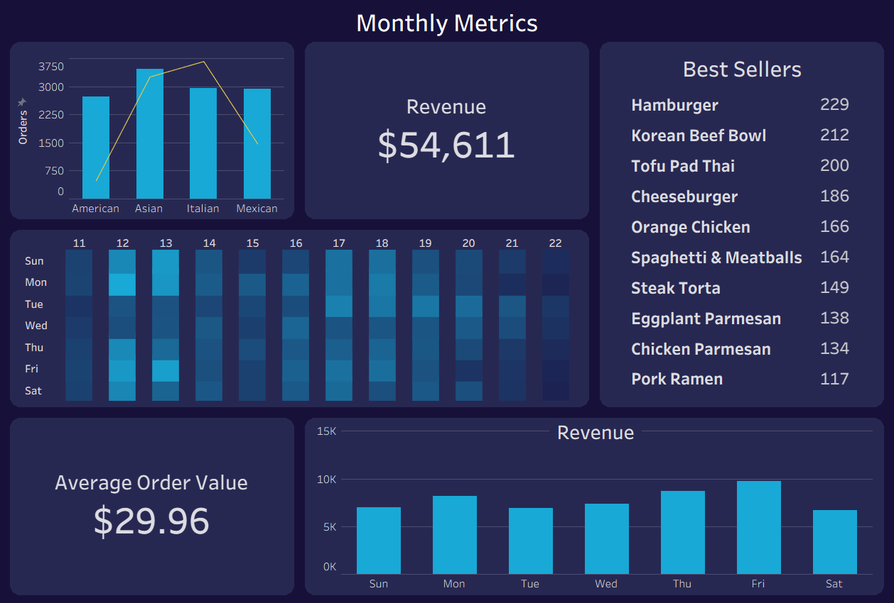

# Restaurant Sales Dashboard (Excel + Tableau)

## Project Overview

This project analyzes restaurant sales data to evaluate performance trends, product behavior, and ordering patterns.

The analysis focuses on transforming raw data into a structured format using Excel, followed by building a dashboard to highlight key business insights.

Excel was used for data cleaning, transformation, and exploratory analysis, while Tableau was used to create a final interactive dashboard.

---

## Objectives

The goals of this analysis were to:

- Evaluate sales performance over time  
- Analyze product and category-level performance  
- Understand customer ordering behavior  
- Build key metrics such as total revenue and average order value  
- Design a clean and effective dashboard for business insights  

---

## Tools & Technologies

- Microsoft Excel  
- Tableau  
- GitHub  

---

## Dataset

Source: (https://mavenanalytics.io/data-playground/restaurant-orders)

The dataset contains restaurant order-level data, including items sold, categories, and transaction details.

Data preparation, cleaning, and transformation were performed in Excel.

---

## Key Visualizations

### Sales Trends Over Time  
This visualization highlights revenue patterns and overall business performance.

### Product & Category Performance  
Identifies top-performing items and categories based on sales and quantity.

### Order Behavior Analysis  
Explores how orders vary by time, frequency, or structure.

### KPI Metrics  
Includes key metrics such as total revenue and average order value.

---

## Dashboard Preview

---

## Tableau Workbook

The Tableau dashboard is available here:

`tableau/restaurant_dashboard.twbx`

---

## Excel Workbook

The Excel file used for data preparation and analysis is available here:

`excel/restaurant_analysis.xlsx`

This file includes:

- Cleaned tables  
- Joined dataset  
- Pivot tables  
- Dashboard template  

---

## Process

1. Cleaned and structured raw data in Excel  
2. Created a joined dataset for analysis  
3. Built pivot tables to explore trends and metrics  
4. Designed a dashboard template in Excel  
5. Developed a final dashboard in Tableau  

---

## Repository Structure

restaurant-sales-dashboard/

├── excel/  
├── tableau/  
├── images/  
└── README.md  

---

## Skills Demonstrated

- Data cleaning and transformation (Excel)  
- Pivot tables and exploratory analysis  
- Data visualization (Tableau)  
- Dashboard design  
- Business data analysis  

---

## Author

Ethan Long  
Aspiring Data Analyst  

[LinkedIn](https://www.linkedin.com/in/ethan-long-652165289/)
